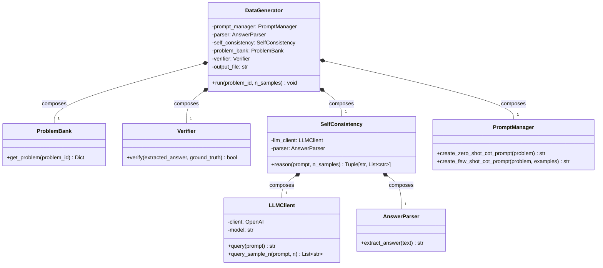
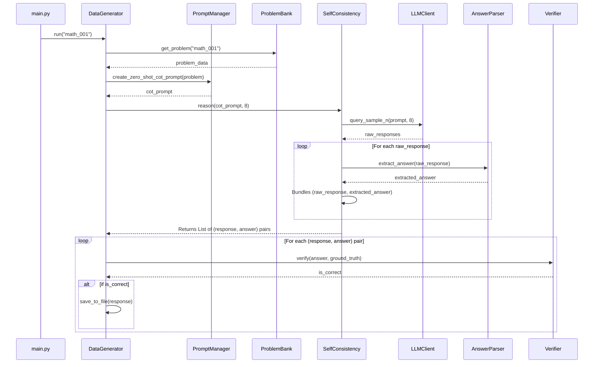
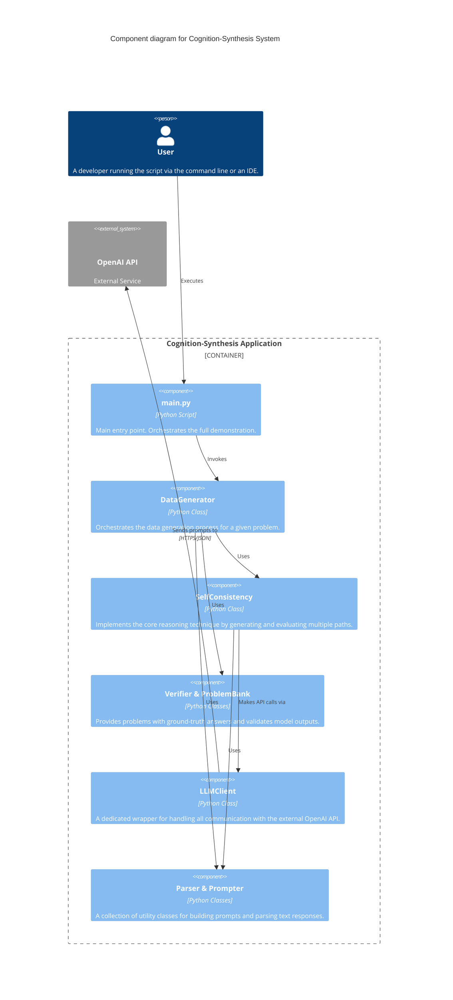
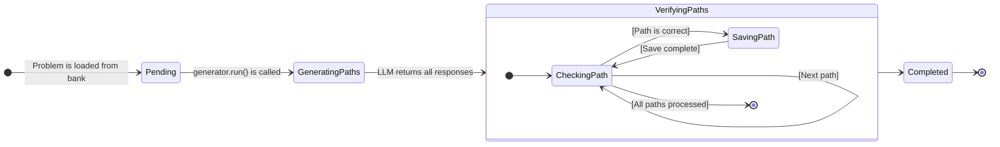

# Cognition-Synthesis: Architectural Design

This document outlines the software architecture for the `cognition-synthesis` project. The diagrams are created using Mermaid to provide a clear visual reference for the system's components and their interactions.

## 1. Class Diagram

The Class Diagram shows the static structure of the project, detailing the key classes and their relationships. It highlights how responsibilities are divided among different components.

-   `DataGenerator` is the main orchestrator.
-   It uses a `ProblemBank` to get problems and a `Verifier` to check answers.
-   It relies on `SelfConsistency` to manage the reasoning process.
-   `SelfConsistency` in turn uses the `LLMClient` to interact with the external API and the `AnswerParser` to extract results from the responses.

## 2. Sequence Diagram

This Sequence Diagram illustrates the dynamic interactions between objects when the `run_data_generation_pipeline()` function is executed. It shows the flow of calls from the main script through the components to generate and verify a single correct reasoning path.

## 3. C4 Component Diagram

The C4 model helps to visualize software architecture at different levels of abstraction. This Component Diagram shows the main components within the `cognition-synthesis` system. It provides a high-level view of how the system is structured.

## 4. State Diagram

This State Diagram models the states of a single "Problem" as it moves through our data generation pipeline. It provides a simple, clear view of the lifecycle of a problem during processing.

